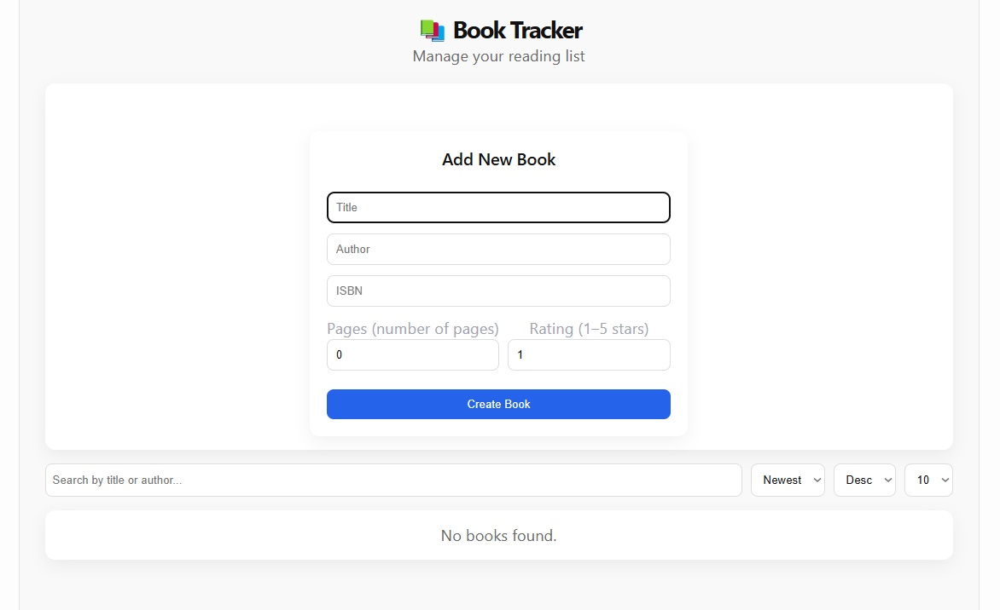
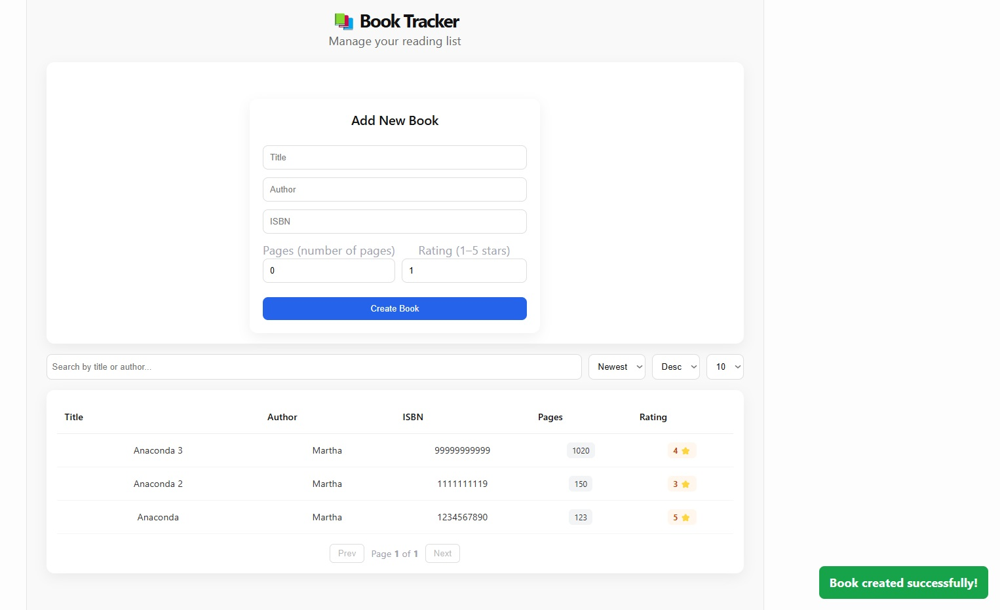
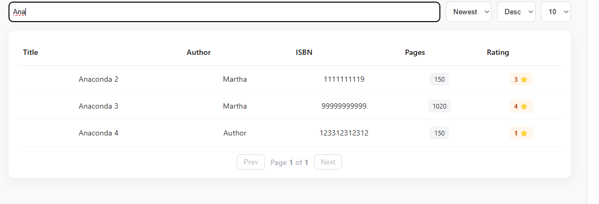
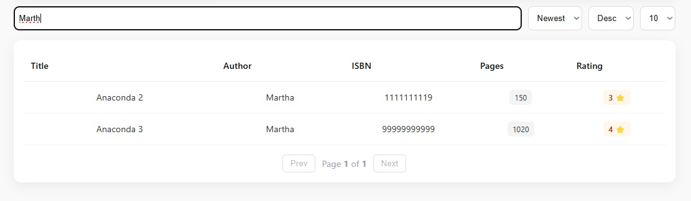
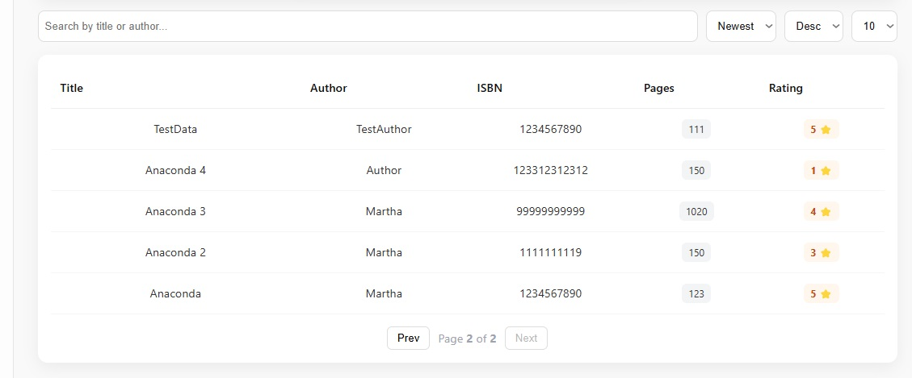
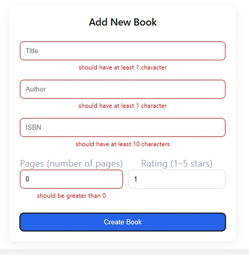
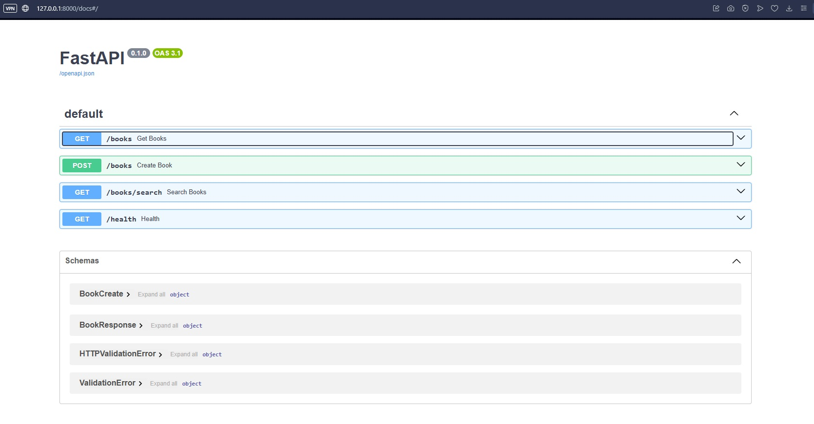

# 📚 Book Tracker API

A scalable backend system built with **FastAPI** for managing books.

Designed with performance, clean architecture, and real-world scalability in mind.

Supports datasets of **10M+ records** with pagination, indexing, and optimized queries.

---

## 🎯 Features

### 📖 Book Management
- Create books
- List books (paginated)
- Strong backend validation
- Clean API responses

---

### 🔎 Search
- Search by title and author
- Case-insensitive partial matching
- Optimized database queries

---

### 📄 Pagination
- Server-side pagination (skip / limit)
- Efficient for large datasets
- Prevents memory overload

---

### 🔃 Sorting
- Sort by:
  - id / created_at
  - title
  - author
  - pages
  - rating
- Asc / Desc ordering

---

## 🧠 Architecture Decisions

- PostgreSQL database
- Indexed columns (title, author)
- Separation of concerns (routes / schemas / models / db)
- Pydantic validation layer
- REST API stateless design
- Query-level filtering in database (no in-memory operations)

---

## 🏗️ Tech Stack

- FastAPI
- SQLAlchemy
- PostgreSQL
- Pydantic
- Uvicorn
- Pytest

---

## 📁 Project Structure

````
app/
├── main.py
├── database.py
├── models.py
├── schemas.py
├── routes.py
````
---

## 🔌 API Endpoints

### Create Book
````POST /books````

### Get Books
````GET /books?skip=0&limit=10````

### Search Books
````GET /books/search?q=title````

---

## 🧪 Validation Rules

- title → required (min 1 char)
- author → required (min 1 char)
- isbn → min 10 chars
- pages → > 0
- rating → 1–5

---

## 📈 Scalability

- Indexes on title and author
- Pagination instead of full dataset loading
- Database-level filtering
- Optimized query execution

---

## 🔌 API Design Notes

The backend API follows a consistent response structure for all endpoints:

```json
{
  "data": [...],
  "total": 123
}
```

### 📄 Why this structure?

- Ensures consistent frontend handling
- Simplifies pagination logic
- Avoids handling multiple response formats for search and list endpoints

---

## 🔎 Search vs Pagination

Both listing and search endpoints support server-side pagination:

### Normal listing
```
GET /books?page=1&limit=10
```

### Search
```
GET /books/search?q=keyword&page=1&limit=10
```

### Behavior

- Search does NOT return a separate format
- It uses the same pagination model as normal listing
- `total` always reflects filtered dataset size

---

## ⚙️ Frontend Integration Rule

Frontend always treats responses as:

- `data` → array of books
- `total` → total matching records

This allows unified pagination logic across all views.

## 📸 Screenshots

### 1. UI


### 2. Create Book


### 3.1 Title Searching

### 3.2 Author Searching


### 4. Pagination


### 5. Validation Errors


### 6. Swagger UI

---

## 🖥️ Run Project

Backend:
``uvicorn backend.app.main:app --reload``

Frontend:
``
npm install
npm run dev``

---

## 🧪 Tests

``pytest backend/tests``

---

## 🚀 Future Improvements

- Docker setup
- JWT authentication
- Redis caching
- Full-text search (PostgreSQL tsvector)
- CI/CD pipeline

---

## 👤 Author

Backend project built for recruitment task.

Focus:
- scalable architecture
- clean code
- database design
- real-world backend practices

---

## 📌 Status

✔ Backend complete  
✔ Database integration  
✔ Search + pagination  
✔ Validation  
✔ Tests  
⏳ Frontend polishing (optional)

## 🤖 Use of AI Tools

During the development of this project, AI tools (ChatGPT) were used as a supporting assistant for:

- Debugging backend and frontend issues (e.g. API errors, React state issues)
- Improving code structure and refactoring for better readability
- Designing scalable API architecture (pagination, search, validation)
- Enhancing UI/UX decisions for a cleaner SaaS-like interface
- Writing and improving documentation (README structure and clarity)

AI was used only as a **support tool**, not as a replacement for understanding or implementation.

---

## ✔ Verification Process

All AI-generated suggestions were verified through:

- Manual testing of backend endpoints (FastAPI / Swagger UI)
- Database validation using PostgreSQL (pgAdmin)
- Frontend testing in browser (React development server)
- Debugging and step-by-step reproduction of issues
- Ensuring type safety and runtime correctness (TypeScript checks)
- Iterative adjustments based on real application behavior

---

## 🧠 Summary

AI tools were used to accelerate development and assist with problem-solving, while all final decisions, implementations, and testing were performed manually to ensure correctness and understanding.